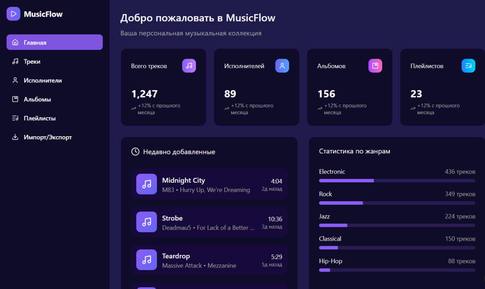
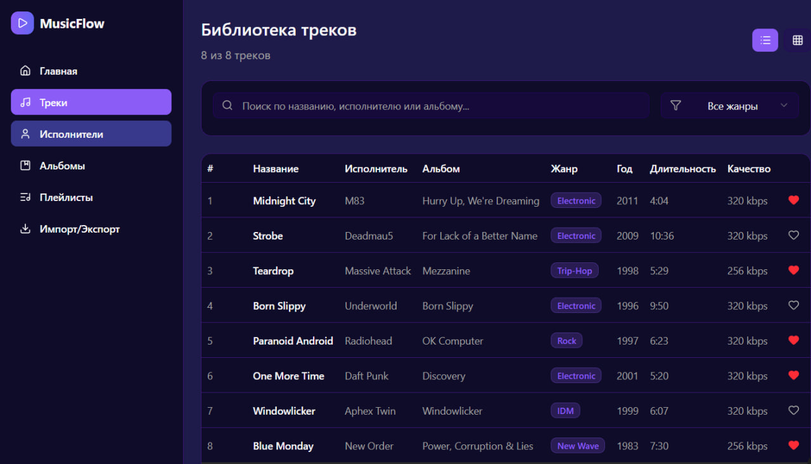
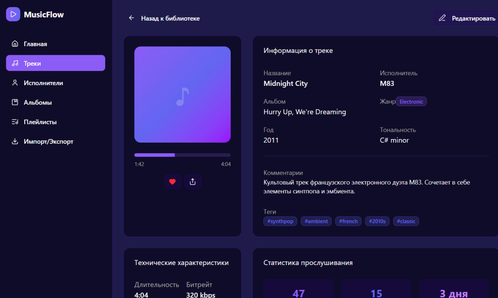
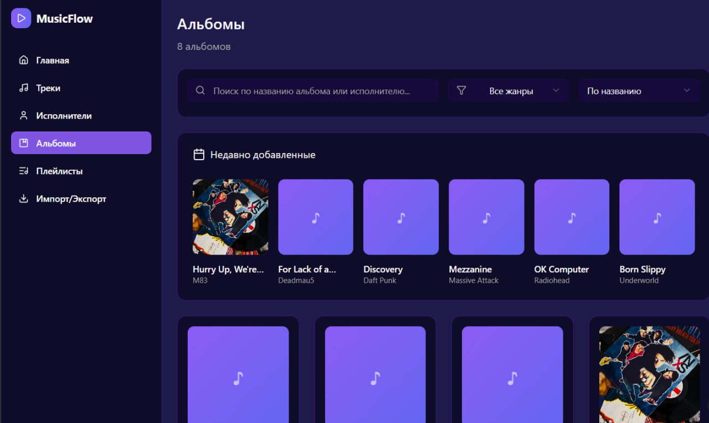
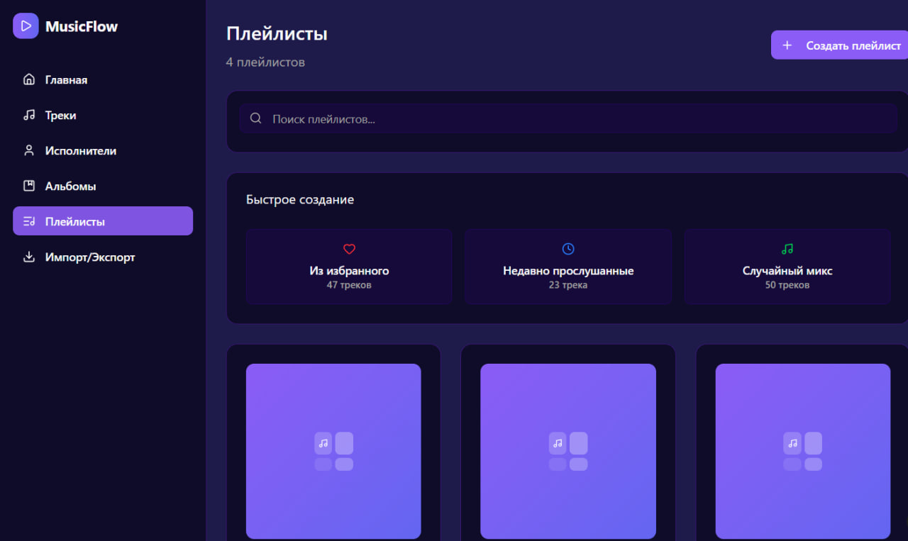
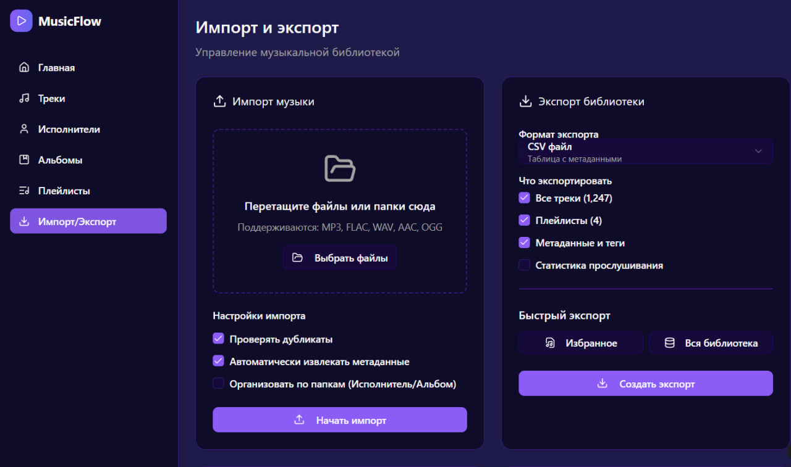

```markdown
# 📋 System Requirements Specification
## MusicFlow: Персональный менеджер музыкальной коллекции

## 📑 Содержание
1. [Введение](#intro)  
   1.1 [Назначение](#appointment)  
   1.2 [Бизнес-требования](#business_requirements)  
   1.3 [Аналоги](#analogues)  
2. [Требования пользователя](#user_requirements)  
   2.1 [Программные интерфейсы](#software_interfaces)  
   2.2 [Интерфейс пользователя](#user_interface)  
   2.3 [Характеристики пользователей](#user_specifications)  
   2.4 [Предположения и зависимости](#assumptions_and_dependencies)  
3. [Системные требования](#system_requirements)  
   3.1 [Функциональные требования](#functional_requirements)  
   3.2 [Нефункциональные требования](#non-functional_requirements)  
4. [Эскизы интерфейса](#mockups)  
5. [Технологический стек](#tech_stack)  
6. [Безопасность и производительность](#security_performance)  
7. [Тестирование](#testing)  
8. [Развёртывание](#deployment)

---

<a name="intro"></a>

## 1. 🧩 Введение

<a name="appointment"></a>

### 1.1 Назначение
Данный документ описывает функциональные и нефункциональные требования к веб-приложению **MusicFlow**, предназначенному для управления персональной музыкальной коллекцией, организации плейлистов и анализа музыкальных предпочтений.

<a name="business_requirements"></a>

### 1.2 Бизнес-требования

#### 1.2.1 Исходные данные
Меломаны и коллекционеры музыки сталкиваются с проблемами:
- Разрозненное хранение музыкальных файлов на разных устройствах
- Сложность организации больших коллекций
- Отсутствие удобных инструментов для анализа музыкальных предпочтений
- Трудности с созданием и управлением тематическими плейлистами

#### 1.2.2 Возможности проекта
Приложение позволяет:
- Централизованно управлять всей музыкальной коллекцией
- Автоматически анализировать метаданные треков
- Создавать умные плейлисты на основе различных критериев
- Визуализировать музыкальные предпочтения и статистику

#### 1.2.3 Доступный функционал
Сервис охватывает:
- Импорт и организация музыкальных файлов
- Автоматическое извлечение метаданных
- Управление плейлистами и тегами
- Статистика и аналитика прослушиваний
- Экспорт коллекции в различные форматы

<a name="analogues"></a>

### 1.3 Аналоги
- **iTunes**: Комплексное решение, но тяжеловесное и с избыточным функционалом
- **MusicBee**: Мощный функционал, но только для Windows
- **Plex**: Фокус на стриминг, слабые возможности управления коллекцией
- **Foobar2000**: Высокая кастомизация, но сложный интерфейс

**Преимущества MusicFlow**: веб-доступность, современный интерфейс, кроссплатформенность, фокус на управлении коллекцией.

---

<a name="user_requirements"></a>

## 2. 👤 Требования пользователя

<a name="software_interfaces"></a>

### 2.1 Программные интерфейсы
- REST API для интеграции с мобильными приложениями
- Web Audio API для предпрослушивания треков
- File API для загрузки музыкальных файлов
- ID3.js для чтения метаданных MP3 файлов
- Документация API через Swagger UI

<a name="user_interface"></a>

### 2.2 Интерфейс пользователя
- Темная тема с фиолетово-синей палитрой
- Адаптивный дизайн для разных устройств
- Drag-and-drop интерфейс
- Интуитивная навигация и быстрый поиск

<a name="user_specifications"></a>

### 2.3 Характеристики пользователей

#### 2.3.1 Аудитория приложения
- **Основная аудитория**: Меломаны, коллекционеры музыки, DJ
- **Вторичная аудитория**: Музыкальные критики, исследователи
- **Техническая подготовка**: От базовой до продвинутой

#### 2.3.2 Профили пользователей
- **Коллекционер**: Большая библиотека, фокус на организации
- **DJ**: Быстрый доступ, создание сетов, BPM анализ
- **Исследователь**: Аналитика, статистика, тегирование

<a name="assumptions_and_dependencies"></a>

### 2.4 Предположения и зависимости
- Современные браузеры с поддержкой Web Audio API
- Доступ к файловой системе для загрузки музыки
- Поддержка основных аудиоформатов: MP3, FLAC, AAC, WAV
- Достаточное место для хранения музыкальной коллекции

---

<a name="system_requirements"></a>

## 3. ⚙️ Системные требования

<a name="functional_requirements"></a>

### 3.1 Функциональные требования

#### 3.1.1 Управление музыкальной коллекцией (FR1)
- **Импорт файлов**: Пакетная загрузка музыкальных файлов через drag-and-drop
- **Авто-метаданные**: Автоматическое извлечение ID3 тегов и другой информации
- **Ручное редактирование**: Возможность редактирования метаданных вручную
- **Организация**: Группировка по исполнителям, альбомам, жанрам, годам

#### 3.1.2 Плейлисты и теги (FR2)
- **Создание плейлистов**: Статические и динамические плейлисты
- **Умные плейлисты**: Автоматическое наполнение на основе критериев
- **Тегирование**: Произвольное тегирование треков пользователем
- **Экспорт плейлистов**: Экспорт в M3U, XSPF форматах

#### 3.1.3 Поиск и фильтрация (FR3)
- **Быстрый поиск**: Instant search по всей коллекции
- **Расширенные фильтры**: Фильтрация по битрейту, длительности, дате добавления
- **Сохраненные поиски**: Сохранение часто используемых фильтров

#### 3.1.4 Статистика и аналитика (FR4)
- **Общая статистика**: Количество треков, исполнителей, альбомов, общее время
- **Аналитика жанров**: Визуализация распределения по жанрам
- **История прослушиваний**: Трекинг прослушанных треков
- **Рекомендации**: Персональные рекомендации на основе истории

#### 3.1.5 Воспроизведение и предпросмотр (FR5)
- **Встроенный плеер**: Basic playback functionality для предпрослушивания
- **Визуализация**: Waveform и спектрограмма треков
- **BPM анализ**: Автоматическое определение темпа для DJ

<a name="non-functional_requirements"></a>

### 3.2 Нефункциональные требования

#### 3.2.1 Производительность
- **Загрузка файлов**: Поддержка пакетной загрузки 100+ файлов одновременно
- **Поиск**: Ответ < 100ms для коллекций до 50,000 треков
- **Отображение**: Плавный скроллинг для больших списков

#### 3.2.2 Надежность
- **Целостность данных**: Автоматическое резервное копирование метаданных
- **Восстановление**: Возможность восстановления после сбоя импорта
- **Обработка ошибок**: Грамотная обработка corrupted audio files

#### 3.2.3 Удобство использования
- **Интуитивность**: Освоение основных функций за 10 минут
- **Доступность**: Поддержка клавиатурных сокращений
- **Отзывчивость**: Immediate feedback на действия пользователя

---

<a name="mockups"></a>

## 4. 🎨 Эскизы интерфейса

### 4.1 Главная страница - Дашборд

*Обзор статистики коллекции и недавно добавленных треков*

### 4.2 Библиотека треков

*Таблица всех треков с расширенной фильтрацией*

### 4.3 Детальная страница трека

*Полная информация о треке и метаданные*

### 4.4 Исполнители

*Список исполнителей с обложками и статистикой*

### 4.5 Альбомы

*Сетка альбомов с обложками и информацией*

### 4.6 Плейлисты

*Управление плейлистами и drag-and-drop функционал*

### 4.7 Импорт/экспорт

*Загрузка музыки и экспорт коллекции*

---

<a name="tech_stack"></a>

## 5. 🧰 Технологический стек

| Компонент | Технология |
|-----------|------------|
| Frontend | React 18 + TypeScript |
| UI Framework | Chakra UI / Tailwind CSS |
| Charts | D3.js / Recharts |
| Audio Processing | Web Audio API, Wavesurfer.js |
| Backend | Node.js + Express |
| Database | PostgreSQL + Redis |
| File Processing | Multer, ID3.js |
| Search | Elasticsearch / Fuse.js |

---

<a name="security_performance"></a>

## 6. 🔐 Безопасность и производительность

### 6.1 Безопасность
- Валидация загружаемых файлов
- Защита от XSS через Content Security Policy
- HTTPS для всех соединений
- Изоляция пользовательских данных

### 6.2 Производительность
- Виртуализация списков для больших коллекций
- Кэширование метаданных в Redis
- Ленивая загрузка изображений обложек
- Оптимизация Web Audio API usage

---

<a name="testing"></a>

## 7. 🧪 Тестирование

### 7.1 Виды тестирования
- Unit tests для utilities и services
- Integration tests для API endpoints
- E2E tests для критических user journeys
- Performance tests для больших коллекций

### 7.2 Тестовые сценарии
- Импорт различных audio formats
- Создание и редактирование плейлистов
- Поиск и фильтрация в большой коллекции
- Обработка corrupted files

---

<a name="deployment"></a>

## 8. 🚀 Развёртывание

### 8.1 Среда развертывания
- **Development**: Docker Compose с hot-reload
- **Staging**: Kubernetes namespace
- **Production**: Cloud platform с CDN

### 8.2 Мониторинг
- Мониторинг использования Web Audio API
- Трекинг размера коллекций пользователей
- Аналитика наиболее используемых функций

---

> 📌 **Примечание**: Данный документ является живым документом и может быть изменен в процессе разработки проекта.

> 📅 **Версия документа**: 1.0  
> 📝 **Последнее обновление**: 15.03.2024  
> 👥 **Ответственные**: [Ваше Имя], [Имя Напарника]
