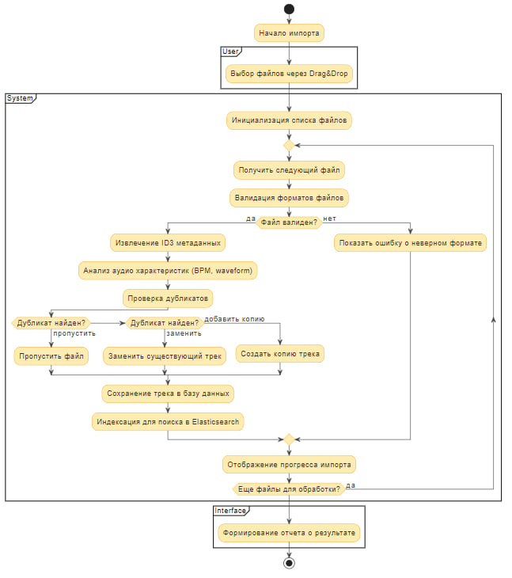
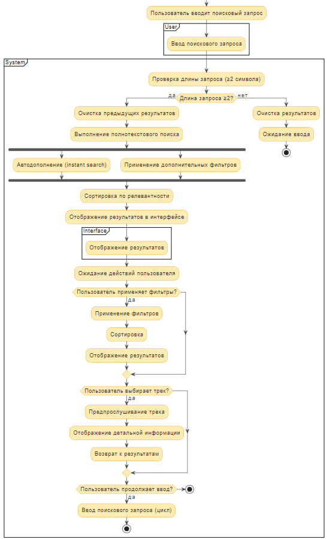
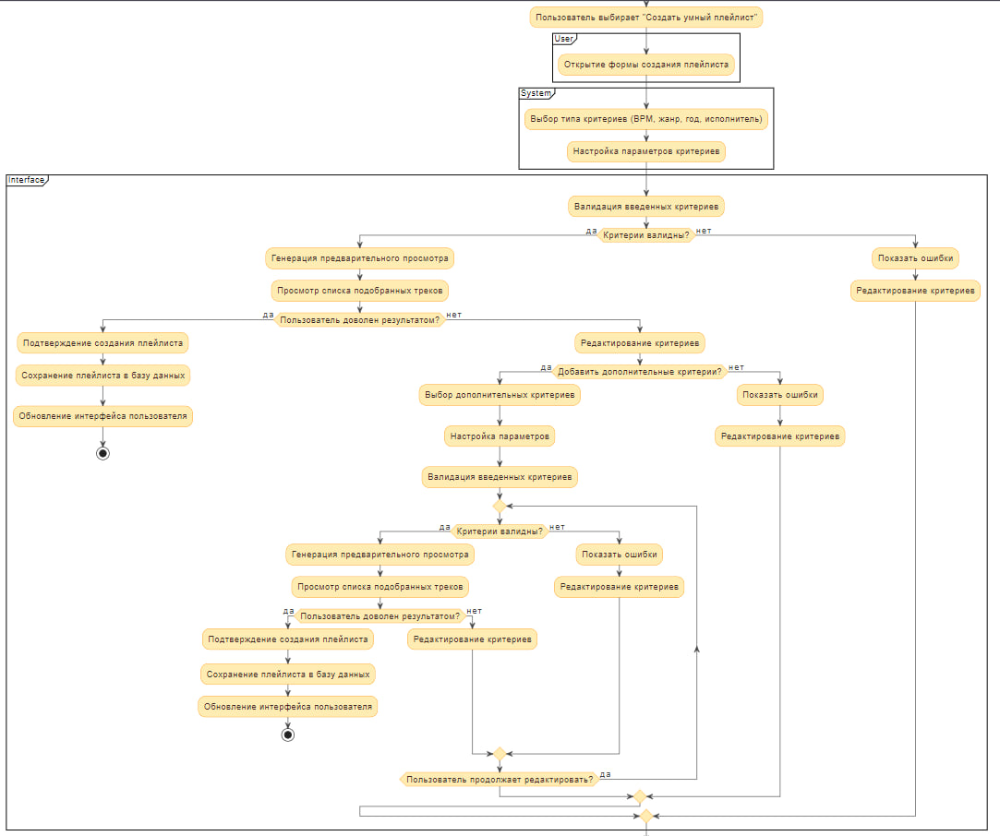
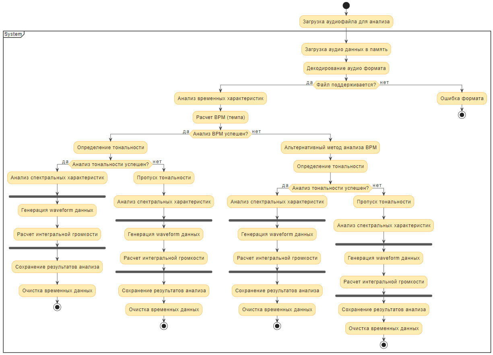
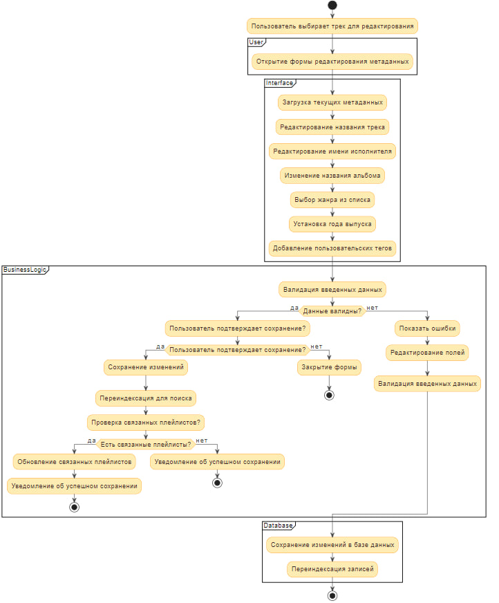

# 📊 Диаграммы активностей — MusicFlow

## 📑 Содержание

1. [Импорт музыкальных файлов](#1)
2. [Поиск треков в коллекции](#2)
3. [Создание умного плейлиста](#3)
4. [Анализ аудио характеристик](#4)
5. [Редактирование метаданных трека](#5)

---

### 1. Импорт музыкальных файлов

**Описание процесса:**
Пользователь загружает музыкальные файлы через интерфейс drag-and-drop. Система последовательно проверяет каждый файл, извлекает метаданные, анализирует аудио характеристики и индексирует треки для поиска. При возникновении ошибок (неподдерживаемый формат, поврежденный файл) система уведомляет пользователя и продолжает обработку остальных файлов.

---

### 2. Поиск треков в коллекции

**Описание процесса:**
Пользователь вводит поисковый запрос в реальном времени. Система проверяет длину запроса и при достаточном количестве символов выполняет поиск по всем метаданным треков. Результаты фильтруются, сортируются по релевантности и отображаются пользователю. При изменении фильтров или выборе конкретного трека система динамически обновляет интерфейс.

---

### 3. Создание умного плейлиста

**Описание процесса:**
Пользователь создает умный плейлист, задавая критерии отбора: диапазон BPM, жанры, годы выпуска, исполнители. Система валидирует критерии, генерирует плейлист на их основе и предоставляет предварительный просмотр. После подтверждения пользователя плейлист сохраняется и может быть отредактирован в дальнейшем.

---

### 4. Анализ аудио характеристик

**Описание процесса:**
Система автоматически анализирует аудио характеристики загруженных треков. Процесс включает определение BPM (темпа), тональности, громкости и генерацию waveform. При успешном анализе данные сохраняются в метаданные трека. В случае ошибок анализа система предпринимает повторные попытки или уведомляет пользователя.

---

### 5. Редактирование метаданных трека

**Описание процесса:**
Пользователь редактирует метаданные выбранного трека (название, исполнитель, альбом, жанр, год). Система проверяет корректность введенных данных и сохраняет изменения. После успешного сохранения метаданных система переиндексирует трек для поиска и обновляет связанные плейлисты и статистику.
