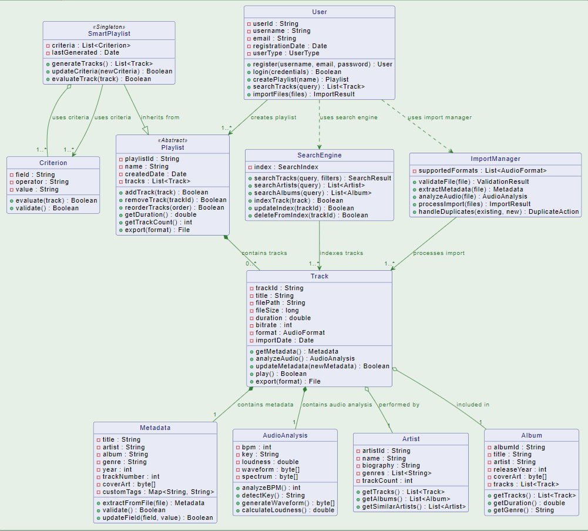

# Диаграмма классов

## Глоссарий

| Понятие | Описание |
|---------|-----------|
| **Пользователь** | Человек, использующий приложение для управления музыкальной коллекцией |
| **Трек** | Аудиофайл с метаданными и техническими характеристиками |
| **Метаданные** | Информация о треке (ID3 теги, название, исполнитель, альбом, жанр) |
| **Анализ аудио** | Результаты технического анализа аудиофайла (BPM, тональность, waveform) |
| **Плейлист** | Упорядоченная коллекция треков, созданная пользователем |
| **Умный плейлист** | Автоматически генерируемый плейлист на основе заданных критериев |
| **Критерий** | Условие для отбора треков в умный плейлист (BPM, жанр, год и т.д.) |
| **Исполнитель** | Музыкант или группа, создавшие музыкальное произведение |
| **Альбом** | Коллекция треков, выпущенных вместе как единое произведение |
| **Жанр** | Музыкальная категория, определяющая стиль трека |
| **Поисковый движок** | Компонент для полнотекстового поиска по музыкальной коллекции |
| **Менеджер импорта** | Компонент для обработки и добавления новых музыкальных файлов |
