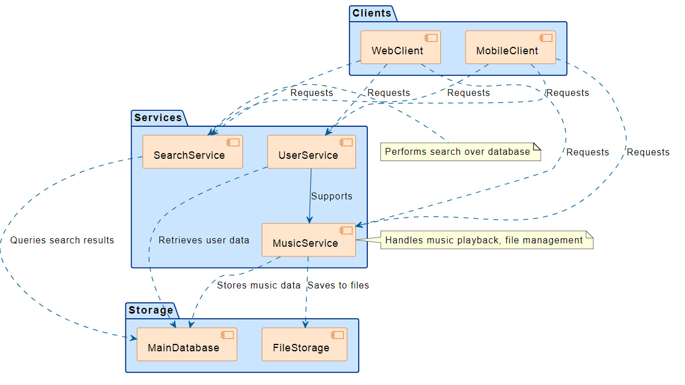
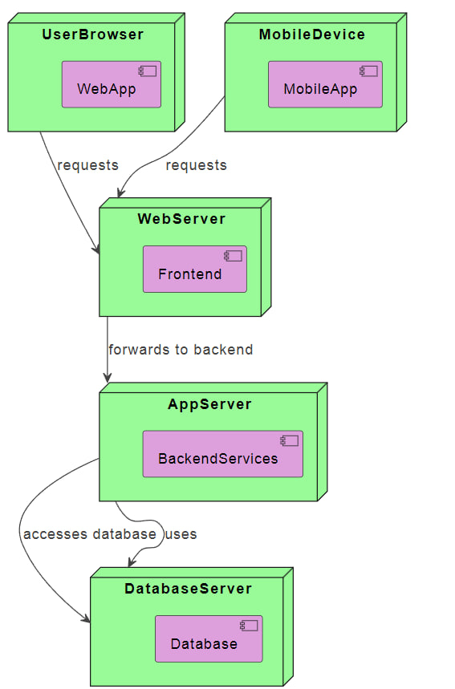

# Диаграмма компонентов

## 📋 Основные компоненты

### 🖥️ Клиентская часть
- **Web Client** - веб-интерфейс приложения
- **Mobile Client** - мобильное приложение

### ⚙️ Серверные сервисы
- **User Service** - управление пользователями
- **Music Service** - работа с музыкой и плейлистами
- **Search Service** - поиск по коллекции

### 💾 Хранилища данных
- **Main Database** - основная база данных
- **File Storage** - хранилище аудиофайлов

# Диаграмма развёртывания

## 🖥️ Узлы системы

### Клиенты
- **User Browser** - веб-браузеры пользователей
- **Mobile Devices** - мобильные устройства

### Серверы
- **Web Server** - веб-сервер приложения
- **App Server** - сервер бизнес-логики
- **Database Server** - сервер базы данных
