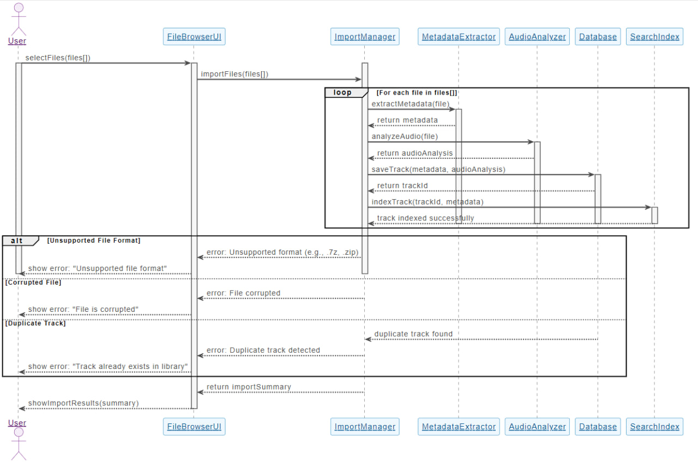
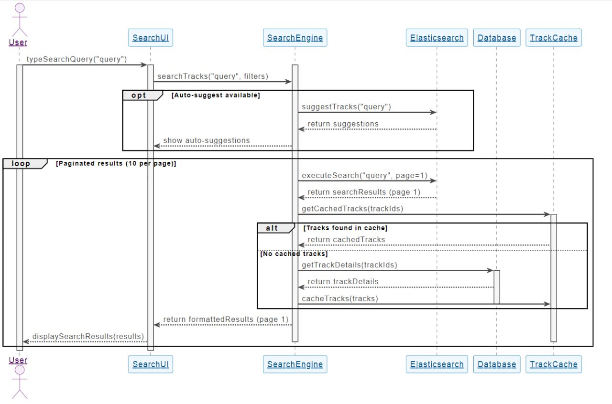
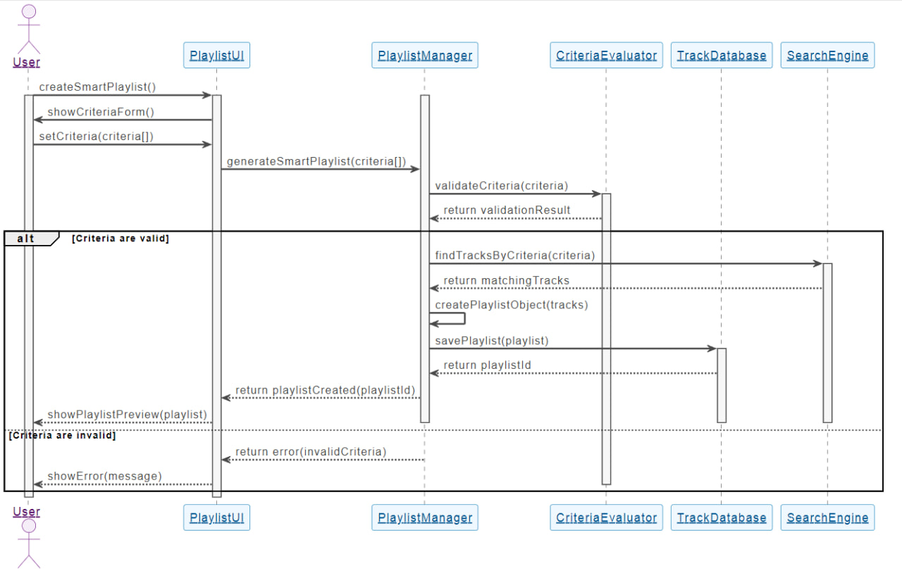
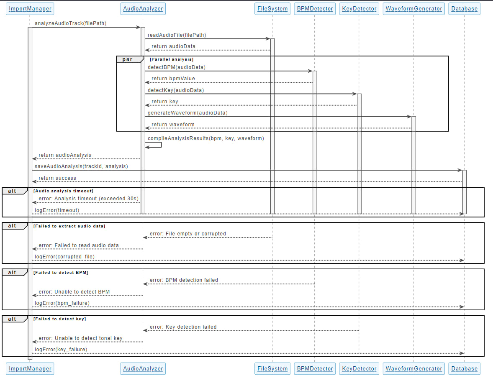
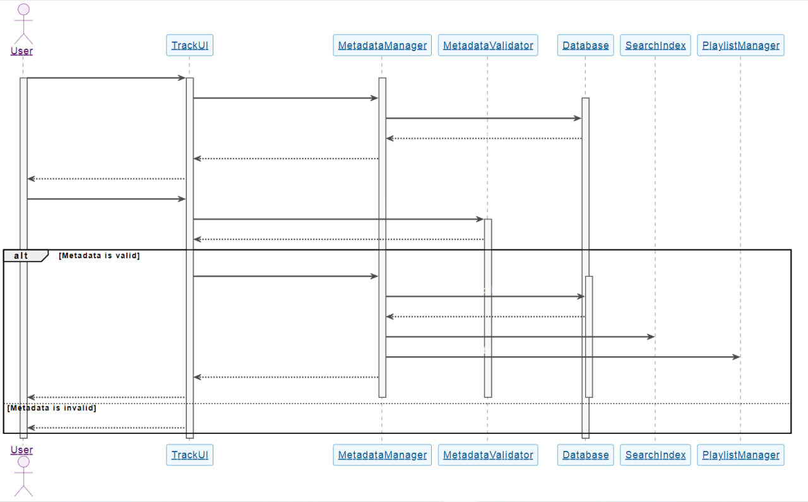

# Диаграммы последовательностей

## Содержание
1. [Импорт музыкальных файлов](#1)
2. [Поиск треков в коллекции](#2)
3. [Создание умного плейлиста](#3)
4. [Анализ аудио характеристик](#4)
5. [Редактирование метаданных трека](#5)

---

### 1. Импорт музыкальных файлов

---

### 2. Поиск треков в коллекции

---

### 3. Создание умного плейлиста

---

### 4. Анализ аудио характеристик

---

### 5. Редактирование метаданных трека

