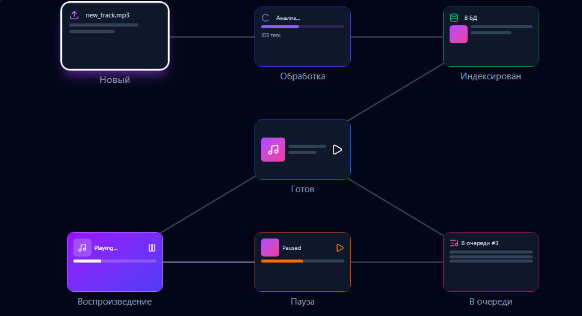
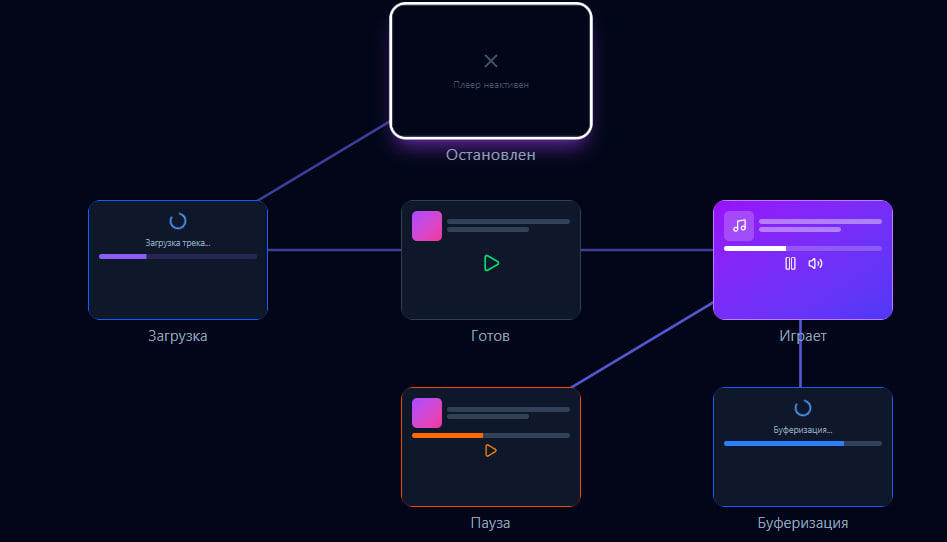
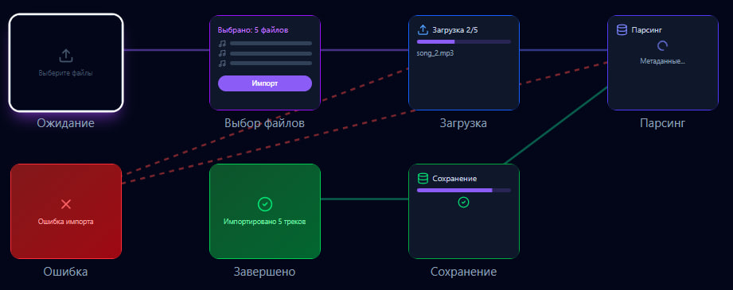
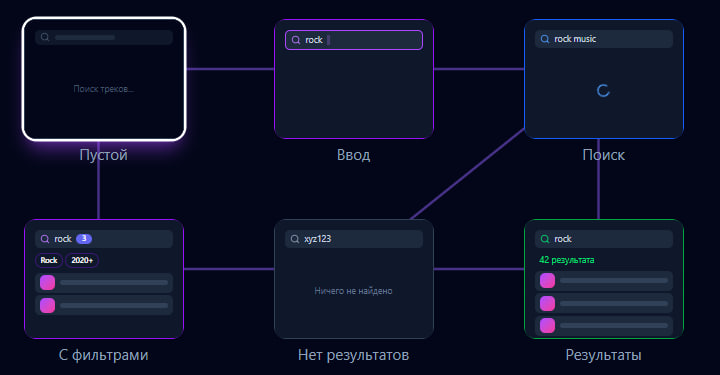
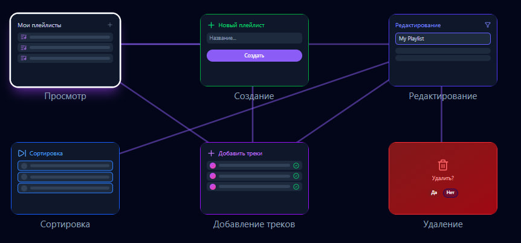

# Диаграммы состояний

## Содержание
- [Состояние трека в системе](#состояние-трека-в-системе)
- [Состояние аудиоплеера](#состояние-аудиоплеера)
- [Состояние процесса импорта](#состояние-процесса-импорта)
- [Состояние интерфейса поиска](#состояние-интерфейса-поиска)
- [Состояние создания плейлиста](#состояние-создания-плейлиста)

---

## Состояние трека в системе

*Соответствует мокапу: Детальная страница трека*

---

## Состояние аудиоплеера

*Соответствует мокапу: Главная страница с элементами управления плеером*

---

## Состояние процесса импорта

*Соответствует мокапу: Окно импорта/экспорта*

---

## Состояние интерфейса поиска

*Соответствует мокапу: Библиотека треков с поисковой строкой*

---

## Состояние создания плейлиста

*Соответствует мокапу: Окно управления плейлистами*
