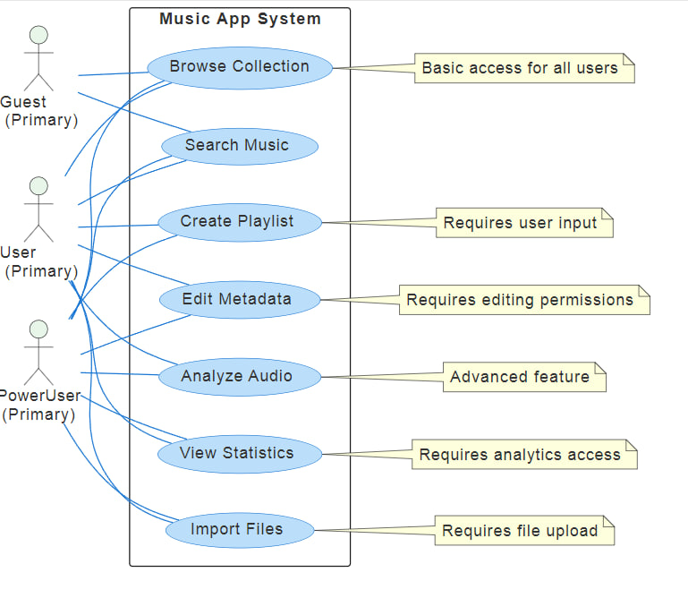

# 📘 Диаграмма вариантов использования — MusicFlow

## 📚 Глоссарий

| Термин | Определение |
|--------|-------------|
| **Пользователь** | Человек, использующий приложение для управления музыкальной коллекцией |
| **Гость** | Пользователь, использующий приложение без регистрации с ограниченным функционалом |
| **Трек** | Аудиофайл с метаданными и техническими характеристиками |
| **Плейлист** | Упорядоченная коллекция треков, созданная пользователем |
| **Умный плейлист** | Автоматически генерируемый плейлист на основе заданных критериев |
| **Метаданные** | Информация о треке (название, исполнитель, альбом, жанр, год) |
| **Анализ аудио** | Процесс определения технических характеристик трека (BPM, тональность, waveform) |
| **Коллекция** | Полный набор музыкальных треков пользователя |

---

## 📑 Содержание

1 Актёры  
2 Варианты использования  
2.1 Зарегистрироваться в приложении  
2.2 Войти в учётную запись  
2.3 Использовать как гость  
2.4 Импортировать музыкальные файлы  
2.5 Просмотреть музыкальную коллекцию  
2.6 Найти треки в коллекции  
2.7 Создать плейлист  
2.8 Создать умный плейлист  
2.9 Редактировать метаданные трека  
2.10 Анализировать аудио характеристики  
2.11 Экспортировать коллекцию  
2.12 Просмотреть статистику коллекции  
2.13 Выйти из учётной записи  

---

## 🎭 1 Актёры

| Актёр | Описание |
|-------|----------|
| **Гость** | Пользователь, использующий приложение без регистрации с базовым функционалом |
| **Зарегистрированный пользователь** | Пользователь с полным доступом ко всем функциям приложения |
| **DJ** | Специализированный пользователь с расширенными функциями анализа музыки |
| **Система импорта** | Автоматический процесс обработки музыкальных файлов |

---

## 🎬 2 Варианты использования

### 2.1 Зарегистрироваться в приложении

**Описание:** Создание новой учётной записи в MusicFlow.  
**Акторы:** Гость  
**Предусловия:** Пользователь выбрал опцию "Зарегистрироваться".

**Основной поток:**
- Приложение отображает форму регистрации;
- Пользователь вводит email, имя пользователя и пароль;
- Приложение проверяет уникальность данных;
- Создаёт профиль пользователя;
- Присваивает статус "Зарегистрированный пользователь";
- Переход на главный экран приложения.

**Альтернативный поток А1:**
- Email или имя пользователя уже используются → сообщение об ошибке;
- Пользователь может ввести другие данные или отменить регистрацию.

---

### 2.2 Войти в учётную запись

**Описание:** Авторизация существующего пользователя в приложении.  
**Акторы:** Гость  
**Предусловия:** Пользователь выбрал опцию "Войти".

**Основной поток:**
- Приложение отображает форму входа;
- Пользователь вводит email/имя пользователя и пароль;
- Приложение проверяет учётные данные;
- Восстанавливает сессию пользователя;
- Переход на главный экран с полным функционалом.

**Альтернативный поток А2:**
- Неверные учётные данные → сообщение об ошибке;
- Пользователь может повторить попытку или восстановить пароль.

---

### 2.3 Использовать как гость

**Описание:** Использование приложения без создания учётной записи.  
**Акторы:** Гость  
**Предусловия:** Пользователь выбрал опцию "Продолжить как гость".

**Основной поток:**
- Приложение присваивает статус "Гость";
- Предоставляет доступ к базовым функциям;
- Переход на главный экран с ограниченным функционалом.

---

### 2.4 Импортировать музыкальные файлы

**Описание:** Добавление новых музыкальных файлов в коллекцию.  
**Акторы:** Зарегистрированный пользователь, Система импорта  
**Предусловия:** Пользователь авторизован.

**Основной поток:**
- Пользователь выбирает опцию "Импорт файлов";
- Приложение открывает диалог выбора файлов;
- Пользователь выбирает аудиофайлы;
- Система импорта обрабатывает файлы;
- Извлекает метаданные и анализирует аудио;
- Добавляет треки в коллекцию;
- Отображает отчёт об импорте.

**Альтернативный поток А3:**
- Неподдерживаемый формат файла → сообщение об ошибке;
- Повреждённый файл → пропуск файла с уведомлением;
- Дубликат трека → предложение вариантов обработки.

---

### 2.5 Просмотреть музыкальную коллекцию

**Описание:** Отображение всей музыкальной коллекции пользователя.  
**Акторы:** Гость, Зарегистрированный пользователь  
**Предусловия:** Пользователь находится в приложении.

**Основной поток:**
- Приложение загружает список треков из коллекции;
- Отображает треки в виде таблицы или сетки;
- Предоставляет возможности сортировки и группировки;
- Отображает основную информацию о каждом треке.

**Альтернативный поток А4:**
- Коллекция пуста → отображение сообщения и предложение импортировать файлы.

---

### 2.6 Найти треки в коллекции

**Описание:** Поиск музыкальных треков по различным критериям.  
**Акторы:** Гость, Зарегистрированный пользователь  
**Предусловия:** В коллекции есть хотя бы один трек.

**Основной поток:**
- Пользователь вводит поисковый запрос;
- Приложение выполняет поиск в реальном времени;
- Отображает результаты с highlighting совпадений;
- Предоставляет фильтры для уточнения поиска.

**Альтернативный поток А5:**
- Ничего не найдено → сообщение "По вашему запросу ничего не найдено";
- Предложение изменить критерии поиска.

---

### 2.7 Создать плейлист

**Описание:** Создание нового плейлиста вручную.  
**Акторы:** Зарегистрированный пользователь, DJ  
**Предусловия:** Пользователь авторизован.

**Основной поток:**
- Пользователь выбирает "Создать плейлист";
- Вводит название и описание плейлиста;
- Добавляет треки через drag-and-drop интерфейс;
- Сохраняет плейлист;
- Приложение добавляет плейлист в библиотеку пользователя.

---

### 2.8 Создать умный плейлист

**Описание:** Автоматическое создание плейлиста на основе критериев.  
**Акторы:** Зарегистрированный пользователь, DJ  
**Предусловия:** Пользователь авторизован, в коллекции есть треки.

**Основной поток:**
- Пользователь выбирает "Создать умный плейлист";
- Задаёт критерии отбора (BPM, жанр, год, исполнитель);
- Приложение генерирует предварительный просмотр;
- Пользователь подтверждает создание;
- Приложение сохраняет умный плейлист.

**Альтернативный поток А6:**
- По критериям не найдено треков → сообщение "Нет треков, соответствующих критериям";
- Предложение изменить критерии.

---

### 2.9 Редактировать метаданные трека

**Описание:** Изменение информации о музыкальном треке.  
**Акторы:** Зарегистрированный пользователь  
**Предусловия:** Трек существует в коллекции пользователя.

**Основной поток:**
- Пользователь выбирает трек для редактирования;
- Приложение отображает форму редактирования метаданных;
- Пользователь изменяет информацию (название, исполнитель, альбом, жанр, год);
- Приложение сохраняет изменения;
- Переиндексирует трек для поиска.

**Альтернативный поток А7:**
- Невалидные данные → сообщение об ошибке валидации;
- Пользователь может исправить данные или отменить изменения.

---

### 2.10 Анализировать аудио характеристики

**Описание:** Определение технических характеристик аудиофайла.  
**Акторы:** DJ, Система импорта  
**Предусловия:** Аудиофайл загружен в систему.

**Основной поток:**
- Система загружает аудиофайл для анализа;
- Определяет BPM (темп) трека;
- Анализирует тональность;
- Генерирует waveform данные;
- Сохраняет результаты анализа в метаданные трека.

**Альтернативный поток А8:**
- Ошибка анализа → повторная попытка или пропуск анализа;
- Недостаточно данных для анализа → частичный анализ с уведомлением.

---

### 2.11 Экспортировать коллекцию

**Описание:** Создание резервной копии музыкальной коллекции.  
**Акторы:** Зарегистрированный пользователь  
**Предусловия:** Пользователь авторизован, коллекция не пуста.

**Основной поток:**
- Пользователь выбирает "Экспорт коллекции";
- Выбирает формат экспорта (CSV, JSON, M3U);
- Указывает параметры экспорта;
- Приложение создаёт файл экспорта;
- Предоставляет ссылку для скачивания.

---

### 2.12 Просмотреть статистику коллекции

**Описание:** Отображение аналитики по музыкальной коллекции.  
**Акторы:** Зарегистрированный пользователь  
**Предусловия:** Пользователь авторизован, коллекция не пуста.

**Основной поток:**
- Пользователь открывает раздел "Статистика";
- Приложение загружает данные коллекции;
- Отображает графики и диаграммы (распределение по жанрам, годам, исполнителям);
- Показывает общую статистику (количество треков, общая длительность, размер коллекции).

---

### 2.13 Выйти из учётной записи

**Описание:** Завершение сессии пользователя.  
**Акторы:** Зарегистрированный пользователь  
**Предусловия:** Пользователь авторизован.

**Основной поток:**
- Пользователь выбирает опцию "Выйти";
- Приложение завершает сессию;
- Очищает временные данные;
- Возвращает пользователя на экран входа.
